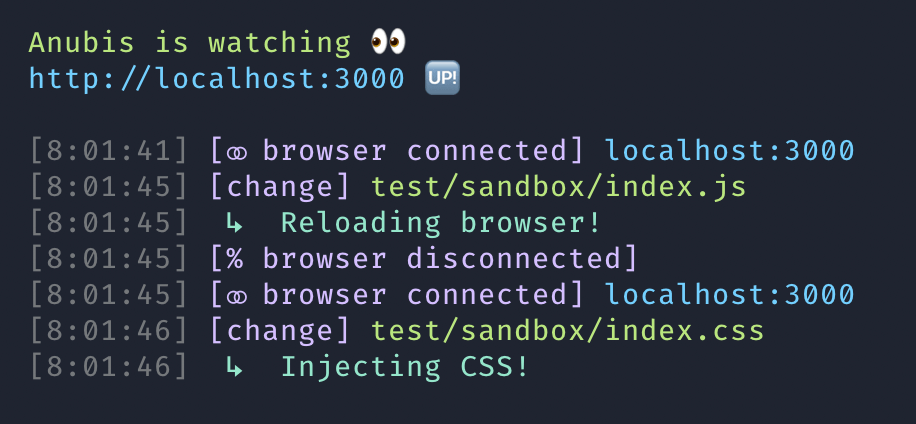

# Anubis 𓁢

Ask Anubis to watch your front-end assets. When those files change, Anubis will inject them and remove the dead link, or reload the browser altogether.



## What Anubis is not

- [HMR](https://webpack.js.org/concepts/hot-module-replacement/) &mdash; this is not Hot Module Replacement and is not intended to replace it. Anubis is best used for websites with minimal client-managed state, and is not recommended for web apps or SPAs.
- [LiveReload](http://livereload.com/) &mdash; shares some ideas from the days of old, but is not at feature parity with LiveReload with things like injecting `<style>` and `` tags.
- [BrowserSync](https://www.browsersync.io/) &mdash; shares some ideas with BrowserSync, but will never meet feature parity. Anubis does not sync scroll position, have a dashboard, etc.

## What Anubis excels at
- Injecting CSS changes (via `link` tags, no `style` support yet)
- Reloading the browser when other files change
- Being very fast and light weight
- Makes working with backend servers easy (does not expect your project to be an SPA)

## Usage

### Install
```shell
npm i -D https://github.com/billcolumbia/anubis
```

### Add npm script
```json
{
    "scripts": {
        "anubis": "anubis -f './public/**/*.{js,css,php}'"
    }
}
```

To use an array of globs for the files option, pass the same `-f` argument *n* times:

```shell
anubis -f './public/**/*.{js,css}' -f './templates/**/*.{twig,html}'
```

### Connect to the proxy
Once anubis is running make sure to connect to localhost at the port you provided (`localhost:3000` by default). If you go to the proxied URL, you wont get any injection or reloading!

## Options/API
```shell
npx anubis --help
```

### `port`:     
**about**: Port to proxy

**required**: no

**type**: number

**default**: 3000

### `target`: 
**about**: URL including port (root for your backend server)
    
**required**: no

**type**: string

**default**: http://localhost:8080

### `files`: 
    
**about**: Files to watch for changes (usually best to watch the compiled files if possible so we don't inject/reload too early)
    
**required**: yes

**type**: string | array (of globs)
    
**default**: null

### `openBrowser`: 
    
**about**: Open browser to proxy server on start?
    
**required**: no

**type**: boolean
    
**default**: true
